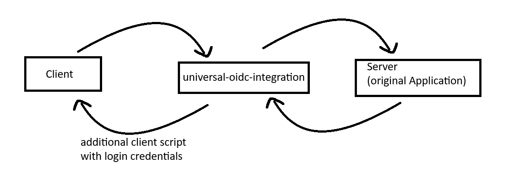

# universal-oidc-integration

Use existing oidc authentication for everything

## Worklow

The universal-oidc-integration forwards all requests and authenticates the user via the OIDC-Configuration.  
Special requests, with Content-Type "text/html" and <DOCTYPE html> at the beginning, get an additional script added.  
This script handles the authentication for the original server. The selectors for the username and password fields can be cutomized to suit the original application.   
Be aware that the credentials for accessing the original server can be extracted by the user, because they are stored on the client side. Even though this seems like a security risk, only already by the universal-oidc-integration authenticated users have access to this file. To be on the safe, please give the USERNAME of the original application only the necesary permissions.

## Setup guide
[SETUP.md](./SETUP.md)

## Environment Variables
| key                     | required / optional (default value)    | Description |
|-------------------------|----------------------------------------|-------------|
| URL                     | required                               | The base url of the original application. |
| USERNAME                | required                               | Username of the user used for the automatic login of the original application. |
| PASSWORD                | required                               | Password for USERNAME |
| USERNAME_SELECTOR       | optional (input[placeholder=Username]) | QuerySelector for the client script to find username field of the original application. |
| PASSWORD_SELECTOR       | optional (input[placeholder=Password]) | Same as USERNAME_SELECTOR |
| SUBMIT_BUTTON_SELECTOR  | optional (button)                      | Same as USERNAME_SELECTOR |
| NO_LOGIN_CHECK_REGEX    | optional (api)                         | Regex (formated to: /api/gm) for paths that don't want to be tampered with. Examples: websockets, video streams, server side events |
| LOGIN_CHECK_DELAY       | optional (1200)                        | Time waited (in ms) after DOMContentLoaded was triggered to ensure the page is fully loaded. 
| LOGIN_CHECK_INTERVAL    | optional (-1)                          | Periodic check for the login page (in ms). Negative values diable this feature. |
| OIDC_ISSUER_URL         | required                               | Base url for the oidc issuer.   Example for Keycloak: https://auth.mydomain.com/auth/realms/master   [More documentation](https://github.com/auth0/express-openid-connect?tab=readme-ov-file#configuring-the-sdk) |
| OIDC_CLIENT_ID          | required                               | Client id for the oidc issuer. |
| OIDC_CLIENT_SECRET      | required                               | Secret for the client id (OIDC-Acces Type must be set to confidential on the issuer). |
| OIDC_BASE_URL           | optional (http://localhost)            | Base url of the frontend path of the universal-oidc-integration. |
| DEV_SKIP_AUTH           | optional (false)                       | Diables OIDC authentication. Only used in devolopment. |

