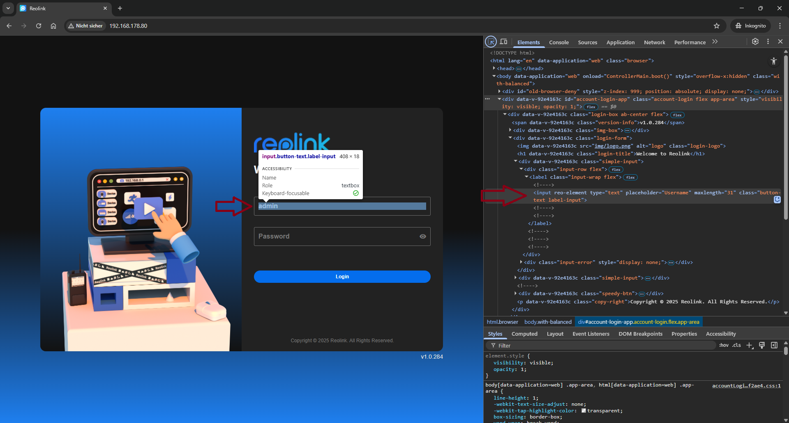
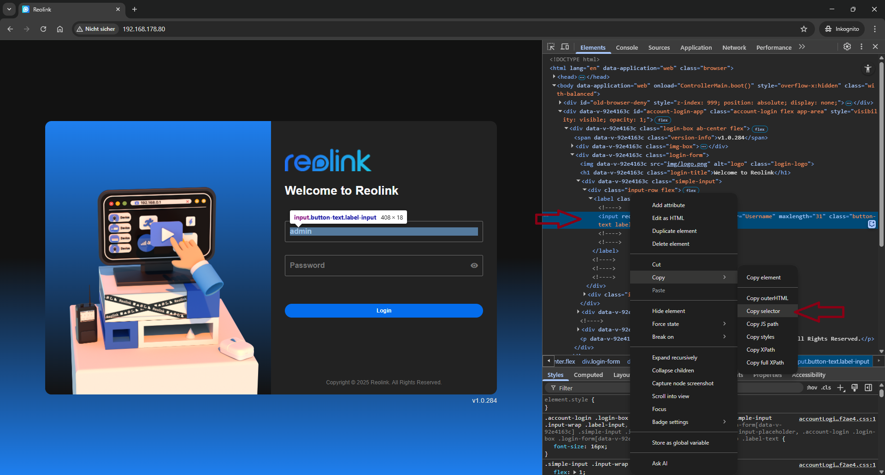
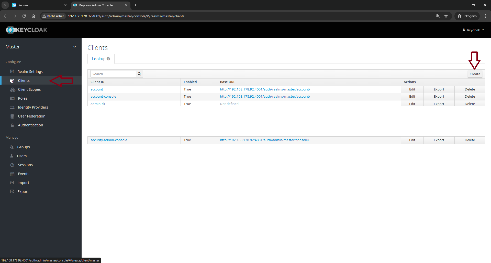
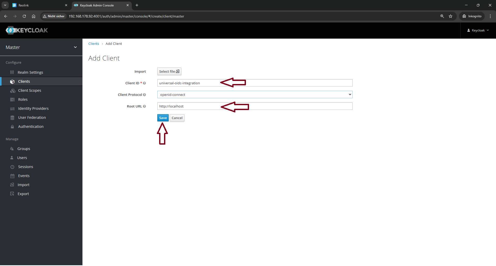
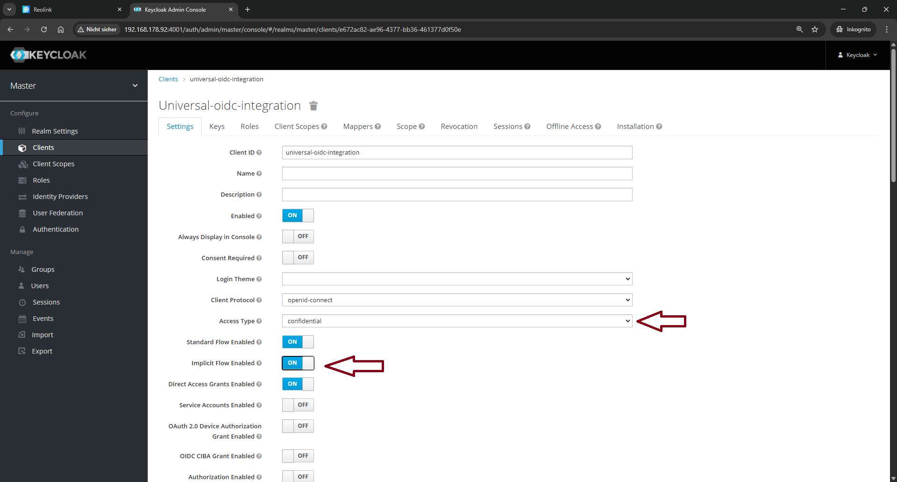
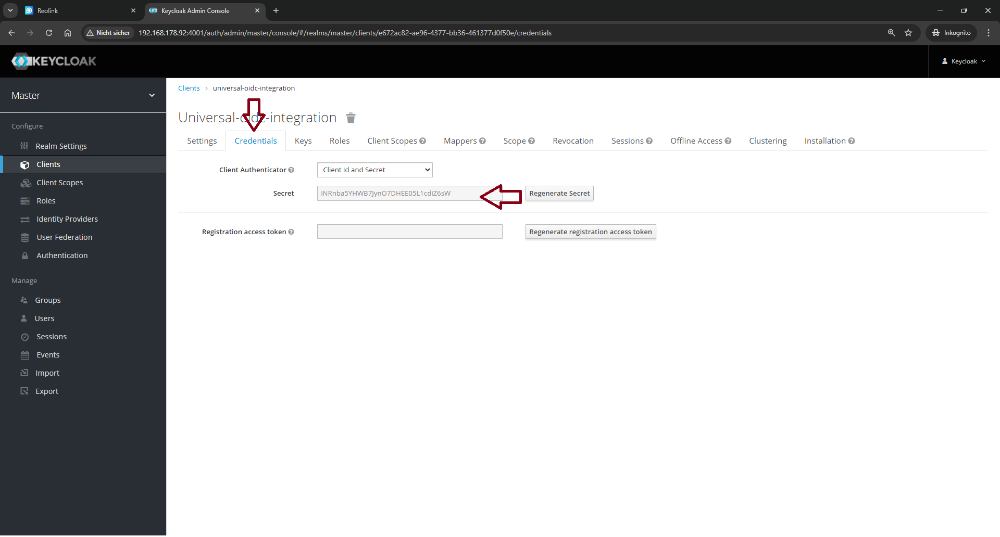

# Step 1
Navigate to the base path of the original application and press Ctrl + Shift + C on the keyboard.

# Step 2
Click on the username filed with the devtools open.
Make sure to select an input field and not a label or div.


# Step 3
Right click on the selected row in the devtools and select Copy > Copy selector
Paste this information as the USERNAME_SELECTOR variable.
Repeat this step for the password field and submit button.


# Step 4 (Keycloak only)
Open the Keycloak dashboard and select clients.


# Step 5
Create a new client with:
- Client Id: universal-oidc-integration
- Root URL: http://localhost
and save your changes.


# Step 6
Change Access Type to confidential and toggle on Implicit FLow Enabled and save your changes at the very bottom.


# Step 7
Copy the secret from the Credentials tab and paste this information as the OIDC_CLIENT_SECRET


# Step 8
Fill in the missing environment variables. The finished docker-compose file:

````
version: "3"

services:
    universal-oidc-integration:
        build: https://github.com/lnoppinger/universal-oidc-integration.git#main
        restart: unless-stopped
        ports:
            - 80:80
        environment:
            - URL=<your original application url from step 1>
            - USERNAME=<username for the original application>
            - PASSWORD=<password for the original application>
            - USERNAME_SELECTOR=<selector from step 3>
            - PASSWORD_SELECTOR=<selector from step 3>
            - SUBMIT_BUTTON_SELECTOR=<selector from step 3>
            - OIDC_ISSUER_URL=https://<keycloak url>/auth/realms/master
            - OIDC_BASE_URL=http://localhost # root url from step 5
            - OIDC_CLIENT_ID=universal-oidc-integration # Client id from step 5
            - OIDC_CLEINT_SECRET=<secret from step 7>
```